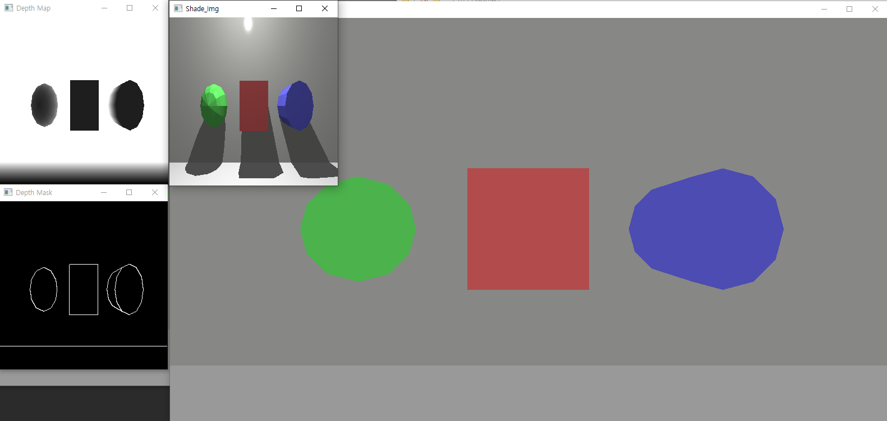

# Thalamus DLL Tescode - Window
 - Tested in window 10 64bit
 - Downlaod  Simul3DDLL.dll, freeglut.dll, opencv_world450d.dll
 - from https://drive.google.com/drive/folders/1JN-bPuIM96y6vYkXszekqJNGTuY8BF_5?usp=sharing
 - Script.txt : three objects
  
 - ScriptFreeModel.txt : one free model 
 - Depth Pnt : depth map from depth cam
 
# Intall
## requirements.txt
  - pip intall -r requirments.txt
## setup.py
  - pip install -e .